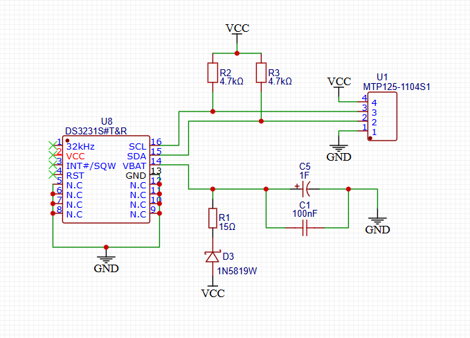
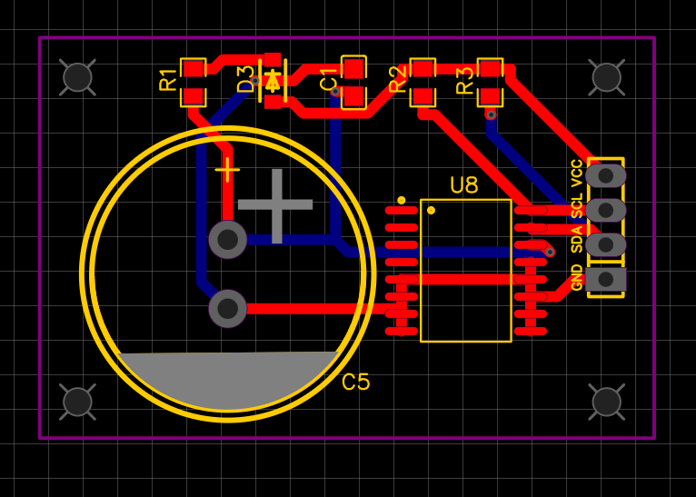
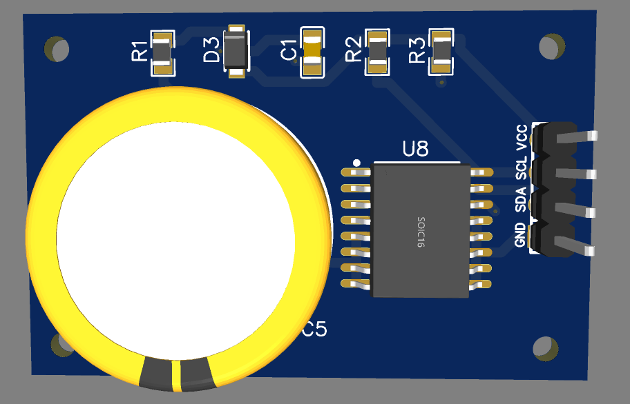

# 🕒 Модуль DS3231 с резервным питанием от суперконденсатора

В этом проекте представлен модуль часов реального времени (RTC), основанный на чипе **DS3231SN**, с резервным питанием от **суперконденсатора** вместо литиевой батарейки.

## 💡 Назначение

- Обеспечить надежный модуль RTC для ESP32 и других микроконтроллеров
- Исключить использование батареек — экологичное решение на базе суперконденсатора
- До **недели** автономной работы от суперконденсатора на 1F при отключении основного питания

---

## 🧩 Особенности

- ✅ Высокоточный RTC-чип DS3231SN
- ✅ Суперконденсатор 1Ф (например, DCL5R5105C, DB-5R5D105T)
- ✅ Диод Шоттки с низким падением напряжения (например, 1N5819W)
- ✅ Фильтрация питания через керамический конденсатор 100нФ
- ✅ Подтягивающие резисторы для линии I²C (4.7кОм)
- ✅ Компактная и эффективная разводка печатной платы
- ✅ Совместимость с Arduino, ESP32, STM32, Raspberry Pi

---

## 🔌 Назначение выводов (разъем 4-pin)

| Номер | Название | Назначение              |
|-------|----------|--------------------------|
| 1     | GND      | Общий (земля)            |
| 2     | SDA      | Линия данных I²C         |
| 3     | SCL      | Линия тактирования I²C   |
| 4     | VCC      | Питание 3.3В или 5В      |

---

## 🔧 Обзор схемы

Модуль включает в себя:
- Чип DS3231SN (корпус SOIC-16)
- Суперконденсатор 1Ф, подключенный к `VBAT` через диод и ограничительный резистор
- Фильтрующий конденсатор 100нФ рядом с `VBAT`
- Подтягивающие резисторы на линиях I²C (R2, R3)
- Все неиспользуемые выводы (SQW, 32kHz, RST) не подключены

# 🕒 DS3231 RTC Module with Supercapacitor Backup

This project contains a custom-designed Real-Time Clock (RTC) module based on the **DS3231SN** chip with **supercapacitor backup** instead of a coin-cell battery.

## 💡 Purpose

- Provide a reliable RTC module for ESP32 and similar microcontrollers
- Eliminate need for batteries — environmentally friendly supercapacitor backup
- Allow over a **week** of operation from a 1F supercapacitor when main power is off

---

## 🧩 Features

- ✅ High-precision DS3231SN RTC
- ✅ 1F Supercapacitor (e.g., DCL5R5105C, DB-5R5D105T)
- ✅ Low forward-voltage Schottky diode (e.g., 1N5819W)
- ✅ Power line filtering (100nF capacitor)
- ✅ Pull-up resistors for I²C lines (4.7kΩ)
- ✅ Compact and efficient PCB design
- ✅ Compatible with Arduino, ESP32, STM32, Raspberry Pi

---

## 🔌 Pinout (4-pin Header)

| Pin | Name | Description          |
|-----|------|----------------------|
| 1   | GND  | Ground               |
| 2   | SDA  | I²C Data             |
| 3   | SCL  | I²C Clock            |
| 4   | VCC  | 3.3V or 5V Power In  |

---

## 🔧 Schematic Overview

The module includes:
- DS3231SN chip (SOIC-16)
- 1F supercapacitor connected to `VBAT` through diode + limiting resistor
- Filtering capacitor 100nF near `VBAT`
- I²C pull-ups (R2, R3) 4.7kΩ
- All unused pins (SQW, 32kHz, RST) left unconnected

> For more details, see: [`hardware/schematics/`](hardware/schematics/)

---

## 📷 PCB Preview

---

## 📦 BOM (Bill of Materials)

| Qty | Reference | Value       | Part Number        | Package |
|-----|-----------|-------------|--------------------|---------|
| 1   | U8        | DS3231SN    | DS3231S#T&R        | SOIC-16 |
| 1   | C5        | 1F 5.5V     | DCL5R5105C         | Radial  |
| 1   | C1        | 100nF       | 0805B104M500NT     | 0805    |
| 1   | R1        | 15Ω         | CR0805J80150G      | 0805    |
| 2   | R2, R3    | 4.7kΩ       | RT0805BRD074K7L    | 0805    |
| 1   | D3        | Schottky    | 1N5819W            | SOD-123 |
| 1   | U1        | 4-pin header| MTP125-1104S1      | 2.54mm  |

---
